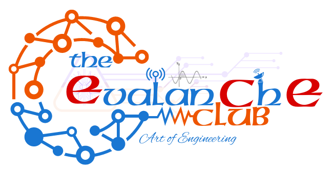

# The EvalanChE Club 

Empowering Innovators in Electronics & Communication

EvalanChE Club is the official Electronics and Communication Engineering (ECE) club at Jain (Deemed-to-be University), dedicated to fostering innovation, hands-on learning, and collaboration in the field of embedded systems, VLSI, IoT, robotics, and beyond.

Check out our website 

---  

## Club Student Co-ordinators

1. Aryan R - President
2. Madhumitha UR - Vice-President 
3. Sreevishnu A - Treasurer 
4. Vaishnav Sabari Girish - Vice-Treasurer
5. Puneeth A - Secretary
6. Radhika Khorana - Vice-Secretary
7. Prasanna Bhore - Organizer
8. Arsh Singh - Vice-Organizer 
9. Hemang Nagpal - Maker's Lab Head 

## Club Faculty Co-ordinator 

1. Prof. Keerthana H M - EvalanChE club faculty co-ordinator. 

## Website Creators and Maintainers

1. Vaishnav Sabari Girish 
2. Razikur Rehman
